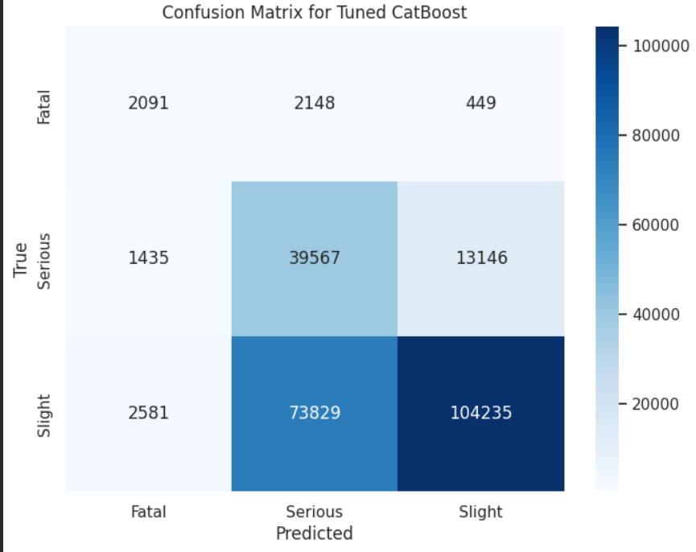
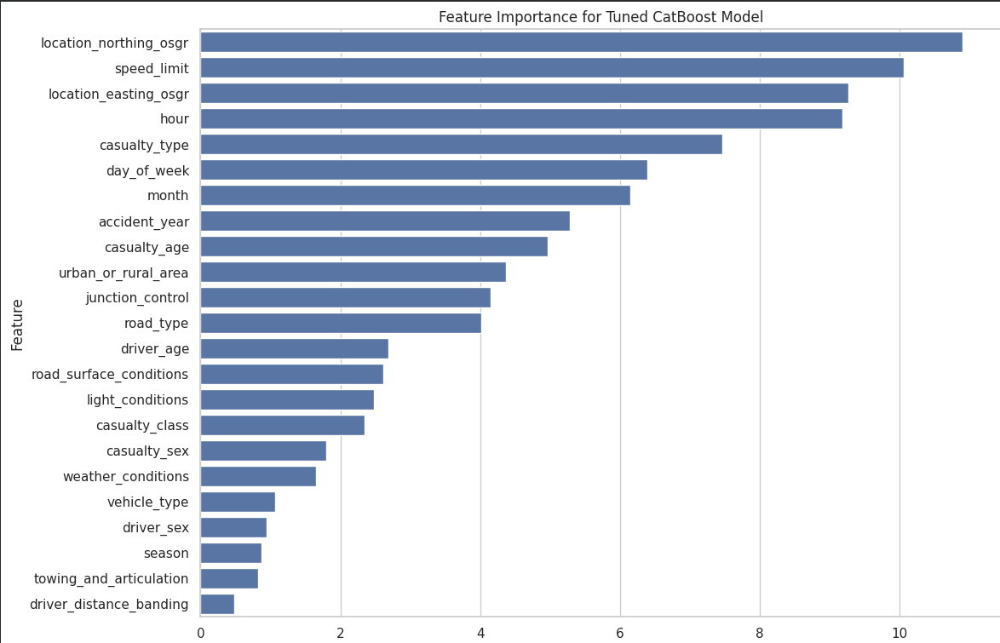

Traffic Accident Severity Analysis using Machine Learning
Overview

This project focuses on analyzing and predicting traffic accident severity using machine learning techniques on a large-scale dataset containing over 1.2 million records. The goal is to identify key factors influencing accident severity and build predictive models that classify accidents into three categories: Slight, Serious, and Fatal.

This project demonstrates a complete end-to-end machine learning pipeline including data preprocessing, exploratory data analysis, feature engineering, model training, and evaluation.

Problem Statement

Traffic accidents are influenced by multiple factors such as time, location, weather, road conditions, and demographic attributes. Understanding these factors is critical for improving road safety and supporting data-driven decision-making.

The objectives of this project are:

To analyze accident patterns using exploratory data analysis
To identify key factors affecting accident severity
To build machine learning models for severity prediction
Dataset Description

The dataset contains more than 1,200,000 accident records with the following feature groups:

Temporal features (hour, day, month, year)
Spatial features (location, urban/rural classification, road type)
Demographic features (driver age, casualty type)
Environmental features (weather conditions, lighting, road surface)
Tools and Technologies
Python
Pandas, NumPy
Matplotlib, Seaborn
Scikit-learn
LightGBM
CatBoost
Jupyter Notebook
Methodology

The project follows a structured machine learning pipeline:

Data Collection → Data Cleaning → Feature Engineering → Exploratory Data Analysis → Model Training → Model Evaluation

Machine Learning Models

The following models were implemented and evaluated:

LightGBM Classifier
CatBoost Classifier
Ensemble Model (LightGBM + CatBoost)
Model Performance
Model	ROC AUC	Macro F1 Score
LightGBM	0.78	0.52
CatBoost	0.79	0.52
Ensemble	0.79	0.53
Key Findings
Night-time accidents have higher severity rates compared to daytime
Rural areas show a higher proportion of fatal accidents
Weather and lighting conditions significantly impact accident severity
Speed limits and road types are strong predictive factors
Weekdays have more total accidents than weekends
Visualizations

The project includes the following visual analyses:

Confusion Matrix
Feature Importance Analysis
Accident Distribution by Time
Severity Distribution
Road Type and Weather Impact Analysis
Example Visuals

Project Structure
Accident-Severity-Analysis/
│
├── Accident_Severity_Analysis.ipynb
├── README.md
├── requirements.txt
├── images/
│   ├── Confusion_matrix.png
│   ├── feature-importance.png
│   ├── roc_curve.png
│   ├── model_comparison.png
│   └── ...
How to Run This Project
git clone https://github.com/abdullahdatascience/Accident-Severity-Analysis.git
cd Accident-Severity-Analysis
pip install -r requirements.txt
jupyter notebook
Author

Muhammad Abdullah
Faisalabad, Pakistan
GitHub: https://github.com/abdullahdatascience

LinkedIn:https://www.linkedin.com/in/abdullahumer12/

Future Improvements
Hyperparameter tuning for improved accuracy
Deep learning models for comparison
Deployment using Flask or FastAPI
Real-time accident severity prediction system
